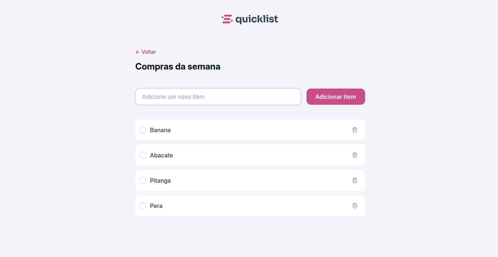

<h1 align="center">QuickList 🛍️</h1>

> Formação Full-Stack: JavaScript: JavaScript Básico. (Desafio prático).

O projeto é um site desenvolvido para ajudar os usuários a organizarem suas compras semanais de forma prática. A aplicação permite adicionar e remover itens da lista com facilidade.

[🔗 Clique aqui para acessar o projeto!](https://fel1324.github.io/QuickList/)

## 🤖 Tecnologias

- HTML e CSS
- JavaScript
- Git e Github

## 💚 Contato

rafael.roberto200618@gmail.com

---

Feito com ♥ by Rocketseat :wave: [Participe da nossa comunidade!](https://discord.gg/rocketseat)